# Love Running

## Responsive Design

- The image below shows how the  site appears across different screen sizes, using the Am I Responsive tool.

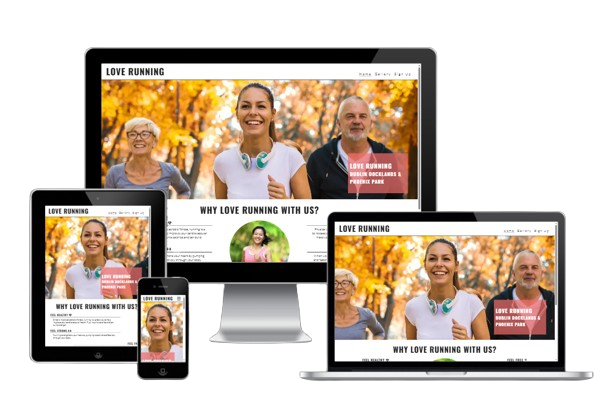

The Love running website is designed to create a welcoming and informal space for runners who wish to socialise and keep themselves fit in Dublin, Ireland. The site provides easily accessible information, regarding meetup times, routes and venues. The website has a simple sign up form so that participants can recieve information

# Features

## Technologies Used

### Languages

- HTML5

- CSS3

### Frameworks, Libraries and Programs
- Google Fonts - Typography
- GitHub - Version Control and Web Hosting
- VS Code - Development Enviroment
- Font awesome -  Social Media Icons
- amiresponsive - Screen Responsiveness
- removebg - remove background from amiresponsive screenshot

## Navigation Bar

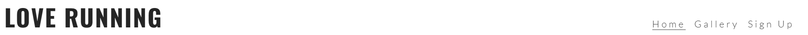

- Fully responsive navbar which is featured on all three pages, providing clean, modern UI with links to the logo, homepage, gallery and signup pages.

- This section will allow the user to easily navigate from page to page across all devices without having to revert back to the previous page via the ‘back’ button.

## The Landing Page Image

- The landing includes a photograph with text overlay to allow the user to see exactly which location this site would be applicable to.

- This section introduces the user to Love Running with an eye catching animation to grab their attention

## The Club Ethos Section

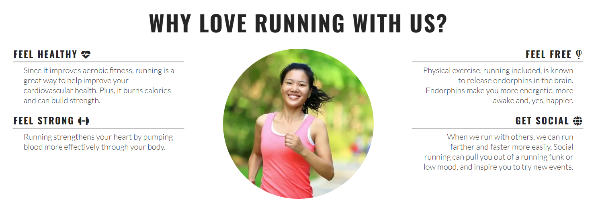

- The club ethos section will allow the user to see the benefits of joining the Love Running meetups, as well as the benefits of running overall.

- This user will see the value of signing up for the Love Running meetups. This should encourage the user to consider running as their form of exercise.

## The Meetup Times Section

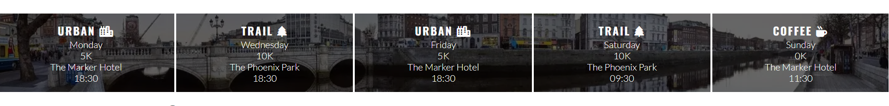

- This section will allow the user to see exactly when the meetups will happen, where they will be located and how long the run will be in kilometers.

- This section will be updated as these times change to keep the user up to date.

## The Footer Section

- The footer section includes links to the relevant social media sites for Love Running. The links will open to a new tab to allow easy navigation for the user.

- The footer is valuable to the user as it encourages them to keep connected via social media.

## The Gallery Page

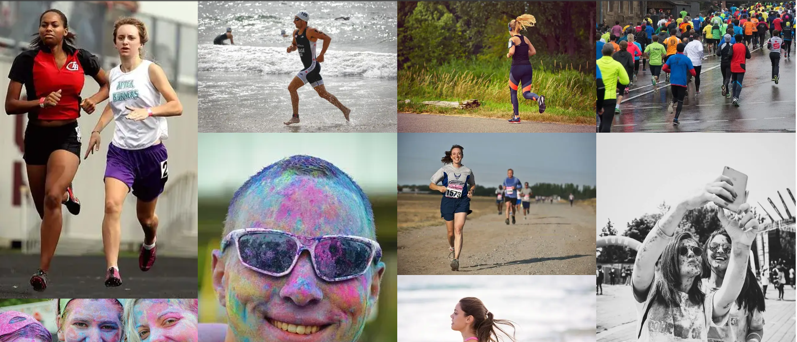

- The gallery will provide the user with supporting images to see what the meet ups look like.

- This section is valuable to the user as they will be able to easily identify the types of events the organisation puts together.

## The Signup Page

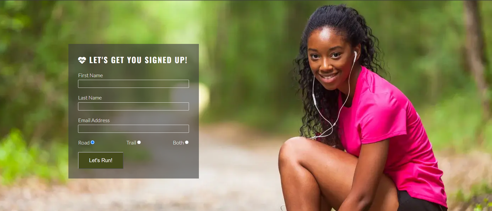

- This page will allow the user to get signed up to Love Running to start their running journey with the community. The user will be able specify if they would like to take part in road, trail or both types of running. The user will be asked to submit their full name and email address.

## Features for future implementation

- ### Interactive Route Maps

  - A future enhancement for this project would be the addition of interactive running route maps. These would show meetup locations, distances, and terrain, helping users visualise the routes before attending a session and improving overall usability.

- ### Member Login System

  - Implement a secure login area where users can track their running progress and access personalised content.

## Testing 

## Validator Testing

- ### HTML Validator

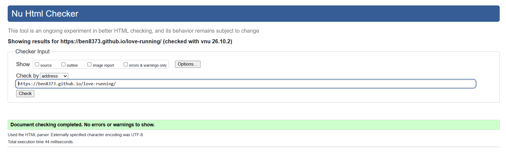

- ### CSS Validator

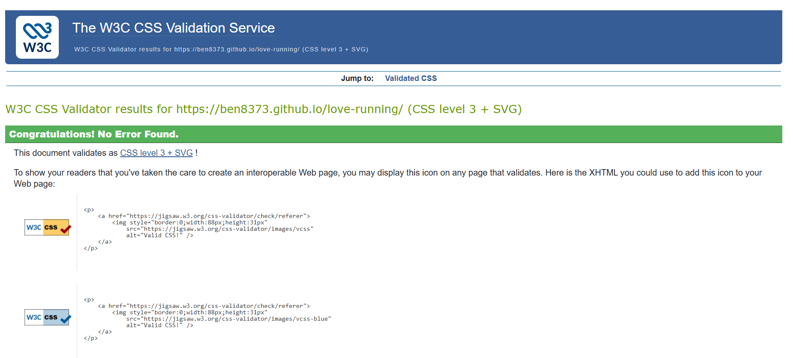

Layout adjusts correctly | Works as expected | Pass |
This completes the required testing section.

## Manual Testing

- The following manual tests were carried out to ensure correct functionality and responsiveness across all pages.

| Feature | Test | Expected Result | Actual Result | Pass/Fail |
|--------|------|-----------------|---------------|-----------|
| Navigation Bar | Click all links | Each link loads the correct page | Works as expected | Pass |
| Navigation Bar | Resize screen | Navbar remains responsive and readable | Works as expected | Pass |
| Landing Page | Load page | Hero image and text overlay display correctly | Works as expected | Pass |
| Club Ethos Section | Scroll | Text and images display correctly | Works as expected | Pass |
| Meetup Times Section | Scroll | Times, locations, and distances visible | Works as expected | Pass |
| Gallery Page | Load page | All gallery images display correctly | Works as expected | Pass |
| Signup Form | Submit empty form | Browser shows required field warnings | Works as expected | Pass |
| Signup Form | Submit valid form | Form submits successfully | Works as expected | Pass |
| Footer | Click social links | Links open in a new tab | Works as expected | Pass |
| Responsiveness | Test on mobile/tablet/desktop | Layout adjusts correctly at all breakpoints | Works as expected | Pass |

## Unfixed Bugs

- ### Sign up page braking due to CSS syntax error

  -  Cause: A stray closing brace ( } ) at the bottom of the CSS file prevented the final media query and layout rules  from loading. This caused the signup page to display incorrectly.

  -  Fix: Removed the extra brace and revalidated the CSS. The signup page now renders correctly across all screen sizes.

- ### Images not displaying on README in GitHub

    - Cause: The image paths in the README were incorrect.

    - Backslashes (\) were used instead of forward slashes (/).

    - Some filenames were misspelled (e.g., responsivness.png instead of responsiveness.png).

    - The README referenced the wrong folder (assets/img/ instead of assets/images/).

   - Fix: Updated all image paths to use the correct folder and correct spelling, and replaced backslashes with   forward slashes. After committing and pushing the corrected files, all images displayed correctly on GitHub.

# Lighthouse Report

- A full Lighthouse audit was carried out, using Chrome DevTools.

- The exported JSON report is included in the repository and can be viewed using the Lighthouse Report Viewer.

[Lighthouse Report Viewer](testing/lighthousereport.json)

- Below is a screenshot of the audit scores.

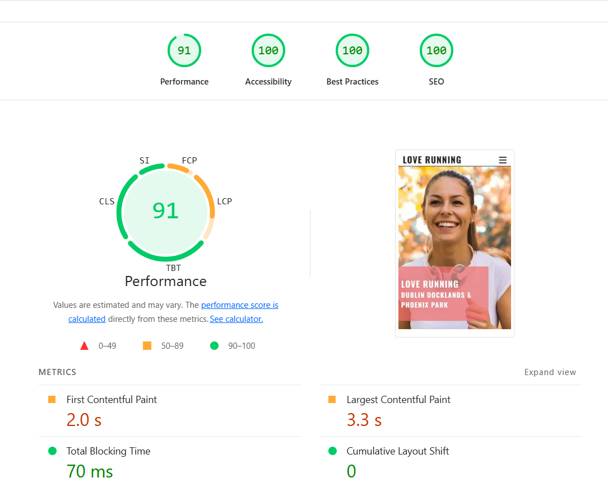

## Deployment

- #### The site was deployed to GitHub pages. The steps to deploy are as follows:

  -  In the GitHub repository, navigate to the Settings tab.

  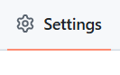

  -  Once in the Settings tab, click on the pages tab in the left hand menu.

  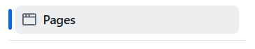

  - Click on the link to the live site.

  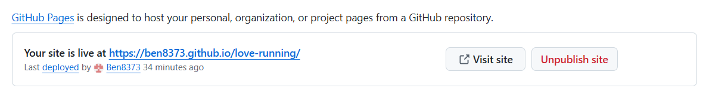

## Credits

###  Content and Code

- All code was written by  myself as part of the Full Stack Software Engineering Diploma.

- Code Institute for learning materials, project structure and guidance.

- Copilot AI was used in the structure and formatting of the README document.

### Resources

- MDN Web Docs — reference for HTML, CSS, and accessibility best practices.

- W3Schools — supplementary reference for CSS layout and styling.

- Google Fonts — typography used throughout the site.

- Font Awesome — icons used in the navigation and content sections.

- Chrome DevTools & Lighthouse — used for performance, accessibility, best‑practice, and SEO testing.

- removebg - For background removal of the am I responsive? screenshot.

- amiresponsive - responsiveness preview tool.

## General Project Advice

